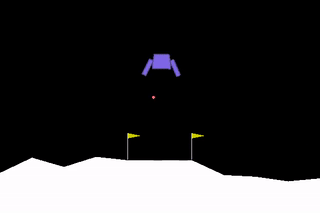

# Lunar Landing with Reinforcement Learning

This project demonstrates an implementation of a controlled lunar landing based on policy gradients with [Generalized Advantage Estimation](https://arxiv.org/abs/1506.02438) in the standard lunar lander gym environment provided by Open AI. The task was to perform a smooth descent and finally land in-between the two flags — using minimal fuel, without damaging the lunar.

  
  <figcaption>One roll-out of the successfully learned optimal policy implemented according to the procedure described below.</figcaption>

### Policy Gradients

The policy gradients can be computed according to the following algorithm. Prior to the initialization, set a learning rate $\alpha$, a discount $\gamma$, an environment $E$ and the number of time steps per episode $T$. Then, initialize the parameters $\theta$ of the policy network.

1) Generate a trajectory $\tau^j$ according to the policy $\pi_{\theta}$ by executing it in $E$ for $T$ steps. Results in $\tau^j = (s_0^j, a_0^j, r_0^j, s_1^j, \ldots s_T^j, a_T^j, r_T^j)$.
2) Compute the discounted cumulative rewards for the trajectory $j$ by $G(\tau^{j}) = \sum_{t=0} \gamma^{t} r_t^{j}$.
3) Compute the gradient $\nabla_\theta J(\pi_\theta)$.
4) Update $\theta \leftarrow \theta + \alpha \nabla_\theta J(\pi_\theta)$.
5) Repeat 1) - 4) until convergence.

The policy gradient $\nabla_\theta J(\pi_\theta)$ relies on the policy gradient theorem and can be unbiasedly estimated by $$\frac{1}{|D|} \sum_{j,t} G(\tau^j) \nabla_\theta log \pi_\theta(a_t^j |s_t^j)$$ where $D$ holds all trajectories and $\nabla_\theta log \pi_\theta(a_t^j |s_t^j)$ is the gradient of the policy network.

### Actor/Critic Interplay

Learning the value function for the policy $\pi$ 

$$V^\pi(s_t) := E_{s_{t+1:\infty,a_t:\infty}}(\sum_{l = 0}^{\infty} r_{t+l})$$

in addition to the policy can help to reduce the gradient's variance. For this reason, I implemented two MLPs, one that paramterizes the state-value function (i.e. the Critic) and one that parametrizes the policy network (i.e. the Actor). Finally, for the actor-critic algorithm, besides the update of the policy paramters as described above, the Temporal-Difference residual needs to be defined in order to update the paramters of the value function at time t

$$\delta_t = r_t + V^\pi(s_{t+1}) - V^\pi(s_{t})$$

This correction term is used to update the paraterms of the Critic network

$$w \leftarrow w + \alpha_w \delta_t \nabla_w V_w(s)$$

where $\alpha_w$ is the learning rate of the Critic network and $\nabla_w V_w(s)$ the gradient of the value function.

The actions that could be taken were either 'nothing', 'fire left engine', 'fire right engine' or 'fire main engine'. Positive reward was obtained for landing between the flags and landing on the lander’s legs. Negative reward is obtained for firing the main engine, side engines or for crashing the lander.

All code is implemented in th `main.py` file. Make sure to have all `requirements.txt` installed.

This project was part of the Probabilistic Artificial Intelligence course at ETH. The skeleton was provided through the course while the core functionality was implemented by the author.
